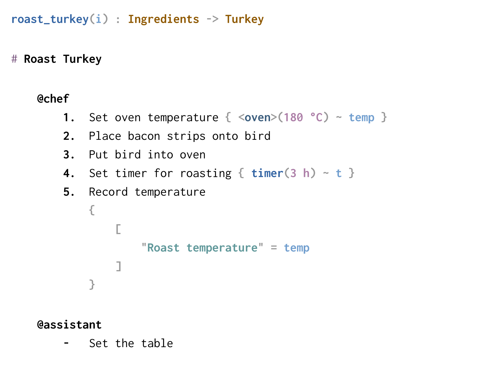

# Technique

This is the Technique Procedure Language, a programming language for
describing procedures in a structured but human-readable form. You can
consider it a domain-specific language (DSL) for writing procedures and
checklists.

This language design has evolved over a long period, 20+ years, starting with
on-paper procedures for systems operations tasks, and then going through
different iterations of program and approach. The current version is Technique
v1, written in Rust.

The Technique language allows you to write instructions to be read and
followed other humans. As a result, Technique doesn't look much like
programming code, but it is nevertheless a formally defined specification for
writing procedures and clear rules for executing them and recording their
outcomes.

## Usage

The _technique_ program has three subcommands:

- _check_ \
  Validate the syntax, structure, and types in a Technique document.

- _format_ \
  Format the code in the given Technique document, embellished with ANSI
  syntax highlighting if run in a terminal.

- _render_ \
  Render the Technique document into a printable PDF. This use the Typst
  typestting language and so requires the _typst_ compiler be installed and on
  `PATH`.

## Contents

This repository contains the _technique_ binary, which is the compiler for
Technique v1, along with a code formatter, and machinery to render procedures
as PDFs. Syntax highlighting is available for Vim, the Zed Editor, Sublime
Text, and the Typst typesetter. There's a language server, and an extension
for Zed, with VS Code and NeoVim on the way.

- Syntax checking, code formatter, renderer (this repository) \
  <https://github.com/technique-lang/technique>
- Formal specification \
  <https://github.com/technique-lang/specification>
- Zed Editor support  \
  <https://github.com/technique-lang/extension.zed>
- Tree Sitter grammar (for syntax highlighting) \
  <https://github.com/technique-lang/tree-sitter-technique>
- Typst and Vim support  \
  <https://github.com/technique-lang/highlighting>

## Examples

To give a sense of the flavour of the language, here are a small selection of
Technique source files rendered to PDFs using the _technique render_ command.

First, from a the recipe for a roast turkey during the holidays:

This from a set of instructions guiding staff of what to do when an incident
occurs:

Finally, an example showing using Technique to describe a much larger
procedure, in this case the entire process of doing systems engineering on a
software project. This pushes the limits of what the language is for, but
nevertheless illustrates that Technqiue can be used for very large structures
as well as very detailed ones:

Detailed examples can be found in the _examples/_ and _tests/_ directories.
Documents written in Technique have file extension _\*.tq_.
